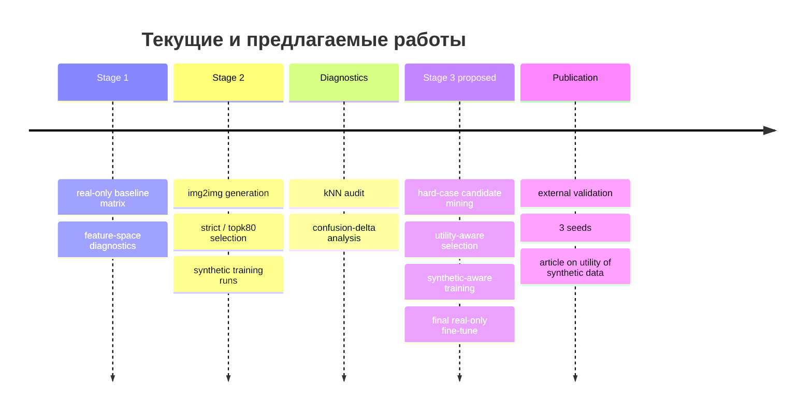
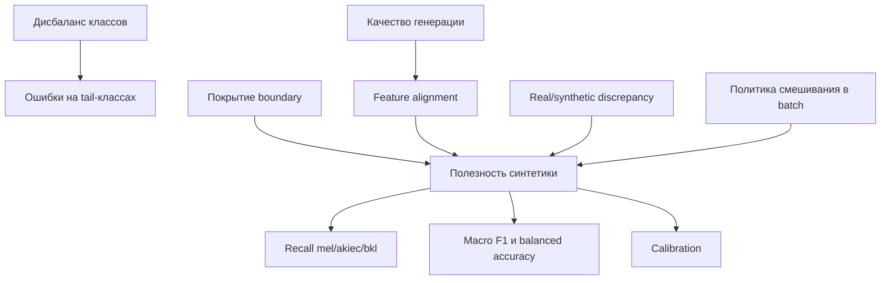

# Глубокое исследование результатов и планов проекта HAM10000

## Executive summary

По предоставленным материалам проект уже достиг важного научного результата: сильные **real-only baseline** на HAM10000 построены корректно, но добавление синтетических изображений в текущем виде **не дало устойчивого выигрыша** по ключевым тестовым метрикам. Лучший результат этапа real-only по `macro F1` составил 0.7989, а по `balanced accuracy` и `worst-class recall` — 0.8279 и 0.7305; ни один запуск Stage 2 не превзошёл эти ориентиры одновременно. Диагностический спринт дополнительно показал, что даже feature-space-отбор синтетики убирает лишь часть «плохих» примеров, но не решает задачу полезности для границы решений, особенно для `mel` и `bkl`. fileciteturn0file1 fileciteturn0file0

С научной точки зрения это не провал, а **сильный отрицательный результат**: современная литература всё чаще показывает, что визуальная правдоподобность синтетики и даже близость к manifold своего класса ещё не гарантируют роста downstream-качества; критичны utility-aware отбор, учёт real/synthetic discrepancy и оценка на уровне задачи, а не только изображения. citeturn2academia0turn4academia0turn4academia1turn4academia2turn5academia0

Практический вывод: следующий этап стоит строить не вокруг «больше синтетики», а вокруг **контролируемого, class-specific и boundary-aware протокола**, с многосеменным дизайном, фиксированной долей синтетики, внешней валидацией и статистическим сравнением на одних и тех же тестовых предсказаниях. Наиболее перспективны четыре линии: генерация вокруг hard cases, synthetic-aware обучение с финальным real-only fine-tune, переход к representation-first методам, а также узкий counterfactual/inpainting-протокол вместо общего img2img. citeturn3academia1turn4academia3turn13academia3turn5academia0

## Корпус доступных результатов и планов

Проект опирается на HAM10000 — датасет из 10 015 дерматоскопических изображений семи диагностических классов; авторы датасета подчёркивают многоисточниковость коллекции и необходимость аккуратной работы с группами/поражениями при построении экспериментов. В документах проекта указан split `train=7011`, `val=1502`, `test=1502` без пересечения по `lesion_id/patient_id`, что методологически верно и снижает риск утечки. citeturn20view0turn15academia3 fileciteturn0file1

Сводная таблица ниже составлена по двум загруженным рабочим меморандумам проекта. fileciteturn0file1 fileciteturn0file0

| Источник/документ | Цель | Методы | Выборка | Ключевые выводы | Ограничения | Статус |
|---|---|---|---|---|---|---|
| Research memo Stage 1–2 fileciteturn0file1 | Построить сильные baseline без синтетики | ConvNeXt-Tiny, 6 режимов loss/sampler, fixed split | train 7011 / val 1502 / test 1502 | Лучший `macro F1` = 0.7989 (`balanced_softmax_none`), лучший `balanced accuracy` = 0.8279 и `worst recall` = 0.7305 (`CE weighted`) | не указано число seeds; нет CI; нет внешнего теста | завершено |
| Research memo Stage 1–2 fileciteturn0file1 | Проверить synthetic augmentation для `mel/akiec/bkl` | SD v1.5 img2img, 960 изображений, два режима отбора | 320 synthetic на класс до отбора | Ни strict, ни topk80 не улучшили лучшие Stage 1 по ключевым метрикам | SD v1.5 не специализирован под дерматоскопию; truncation отрицательных промптов; один seed | завершено |
| Diagnostics memo fileciteturn0file0 | Понять, почему синтетика не помогает | kNN-аудит в feature-space, confusion-delta | raw 120 sampled / strict 43 / topk80 240 | raw содержит 50/120 отрицательных margin; strict чистый, но теряет весь `akiec`; topk80 сохраняет баланс, но не даёт прироста на test | диагностика корреляционная, а не причинная; feature-space зависит от baseline | завершено |
| Diagnostics memo fileciteturn0file0 | Сформировать Stage 3 | boundary-aware utility-aware selection | пока не указано | приоритет hard cases, class-specific quotas, логирование utility-признаков | протокол пока не формализован статистически | запланировано |

Если смотреть на содержательные результаты, проект уже показал две важные вещи. Во-первых, baseline действительно сильный: это повышает ценность отрицательного результата, потому что Stage 2 сравнивался не со «слабым нулём», а с конкурентным real-only ориентиром. Во-вторых, диагностический спринт сузил механизм проблемы: речь не о полном провале генерации, а о несоответствии между feature alignment и реальной полезностью для decision boundary. fileciteturn0file1 fileciteturn0file0

## Научный контекст и обзор литературы

В литературе есть опорные работы, которые хорошо объясняют текущее состояние проекта. Для самого датасета основной источник — Tschandl et al., *Scientific Data* (DOI: **10.1038/sdata.2018.161**), где HAM10000 позиционируется как benchmark для дерматоскопии и подчёркивается неоднородность источников. Для loss-функций важны Focal Loss (Lin et al., ICCV 2017, DOI: **10.1109/ICCV.2017.324**) и Balanced Meta-Softmax (Ren et al., arXiv:2007.10740), где imbalance трактуется соответственно как проблема hard examples и как проблема смещённого softmax при long-tail-distribution. Для representation learning ключева работа Balanced Contrastive Learning (Zhu et al., arXiv:2207.09052), показывающая, что long-tail — это не только вопрос классификатора, но и вопрос геометрии признаков. citeturn20view0turn20view1turn7academia1turn13academia3turn14academia0

Для синтетических данных особенно важны последние работы 2024–2026 годов. Chen et al. показывают, что **augmented conditioning** помогает, когда синтетика остаётся in-domain и одновременно сохраняет разнообразие; систематический обзор по медицинской синтетике подчёркивает, что качественная оценка должна включать не только визуальную правдоподобность, но и feature-level и task-level utility. Отдельно Jiang et al. на skin-lesion задаче демонстрируют, что diffusion-аугментация может быть полезной, если она сочетается с post-selection/OOD-фильтрацией. citeturn4academia0turn2academia0turn3academia1

При этом самые свежие работы объясняют и отрицательные результаты текущего проекта. Dombrowski et al. формулируют **learnability gap**: медицинская синтетика может быть хорошо реконструируема/реалистична, но её латентная структура остаётся неудобной для downstream-классификатора. Ma et al. теоретически показывают, что при хорошо специфицированной модели синтетическая аугментация не обязана давать population-level improvement и может вносить дополнительное смещение; Gupta и Brown эмпирически показывают, что генеративная аугментация в fine-grained и low-data режимах нередко вредит, формируя отдельные synthetic-кластеры. SAU, напротив, предлагает учитывать **real/synthetic discrepancy** явно через synthetic-aware ветвь. citeturn4academia1turn4academia2turn4academia3turn5academia0

Практически это означает, что ваши результаты хорошо согласуются с текущей наукой: проект уже находится не на уровне «получилось/не получилось сгенерировать картинки», а на уровне **условий полезности синтетики** для long-tail медицинской классификации. citeturn2academia0turn4academia1turn4academia2

## Методологический аудит текущих результатов и планов

Этап baseline выполнен методологически добротно. Сильные стороны: group-aware split, фиксированный real-only test, журналирование конфигов и артефактов, сравнение нескольких loss/sampler-режимов. Слабые стороны: в документах **не указано** число seeds, интервальные оценки, статистические тесты, внешний тестовый набор и полный per-class пакет метрик для всех запусков. Поэтому текущий вывод надёжен как **отрицательный вывод о превосходстве Stage 2**, но пока недостаточен для жёсткого ранжирования близких конфигураций. fileciteturn0file1

Этап Stage 2 был построен логично: целевые классы (`mel/akiec/bkl`) выбраны не произвольно, а из feature-space/confusion-анализа baseline; генерация была image-conditioned; затем добавлен post-selection. Однако дизайн имеет четыре слабых места. Первое — генератор общий, а не дерматоскопический. Второе — truncation отрицательных промптов означает, что часть условных ограничений могла не примениться. Третье — strict-отбор вызвал collapse coverage для `akiec` (0 отобранных образцов), а topk80 повысил покрытие ценой ухудшения boundary utility. Четвёртое — synthetic и real, судя по документам, смешивались почти как равноправные наблюдения, без явного modelling discrepancy. fileciteturn0file1 citeturn19academia0turn5academia0turn4academia1

Диагностический спринт — наиболее сильная часть исследования на данный момент. kNN-аудит показал, что raw-пул содержит много потенциально вредных примеров, strict-пул «чище», но теряет покрытие tail-классов, а topk80 представляет рациональный компромисс, который всё равно не даёт выигрыша на test. Конфликт между candidate-only и base-only для Stage 2 почти симметричен на всём test set, но особенно тревожно то, что деградация концентрируется именно в `bkl` и `mel`, то есть в clinically and methodologically central classes. Это признак того, что критерий отбора пока оптимизирует «похожесть на класс», а не **добавочную информацию около границы решений**. fileciteturn0file0

План Stage 3 в документах выглядит верно по направлению, но ещё нуждается в формализации. Чтобы он стал публикационно убедительным, нужно заранее зафиксировать первичную целевую метрику, ограничить пространство экспериментов, оставить 2–3 главные конфигурации для трёх seeds и перенести главный акцент с генератора на **utility-aware pipeline**. fileciteturn0file0 citeturn4academia2turn2academia0

## Избыточности, пробелы и потенциальные ошибки

Главная избыточность — запускать ещё одну большую волну «сырой» генерации без смены критерия полезности. И документы проекта, и современные обзоры говорят, что marginal gain обычно приходит не от объёма синтетики как такового, а от её отбора и способа включения в обучение. Поэтому увеличение количества synthetic images в текущем pipeline, вероятно, даст мало новой информации. fileciteturn0file0 citeturn2academia0turn4academia2

Есть и то, что можно упростить уже сейчас. В следующем спринте стоит временно убрать ветку `balanced_softmax + synthetic`, потому что в имеющихся протоколах она не стала главным победителем ни по `macro F1`, ни по `balanced accuracy`, ни по `worst recall`; оставить её можно только как узкую абляцию. Длинные отрицательные промпты лучше заменить на компактные class-confusion descriptors с обязательным логированием длины токенизации. Наконец, текущий дуэт `strict` и `topk80` полезен как диагностическая история, но в новом цикле достаточно одного **интерпретируемого class-specific utility score** вместо двух параллельных эвристик. fileciteturn0file1 fileciteturn0file0

Критически важные отсутствующие данные, которые нужно явно пометить как **«не указано»**: число seeds; доверительные интервалы; полные confusion matrices; manifest тестового split; полный synthetic manifest и selected manifest; точные промпты и длины токенов; per-class precision/recall/F1 для всех запусков; внешний набор для переноса; протоколы статистического сравнения; клиническая/экспертная верификация синтетики. Получить их можно из run registry, сохранённых CSV/JSON, серверных manifest-файлов и повторных запусков только для 2–3 лучших конфигураций. fileciteturn0file1 fileciteturn0file0

## Варианты переработки исследования

На основе документов проекта и литературы наиболее рациональны следующие варианты. citeturn3academia1turn4academia0turn4academia1turn5academia0turn13academia3

| Вариант | Обоснование | Ресурсы | Риск | Приоритет |
|---|---|---|---|---|
| Hard-case targeted generation | Генерировать только вокруг hard-but-correct и hard-wrong real cases по `mel/akiec/bkl`; это лучше согласуется с идеей boundary utility | 1 инженер, 1–2 GPU-недели, новые manifests | можно переобучиться на шумных hard cases | высокий |
| Synthetic-aware training + final real-only fine-tune | Явный учёт разрыва real/synthetic; SAU-подобная логика и последующая очистка head от synthetic-bias | средние изменения кода, 2–3 seeds | усложнение модели без гарантии выигрыша | высокий |
| Representation-first без новой генерации | Проверить BCL/контрастивный режим и class-balanced representation до новой синтетики | минимальная генерация, больше обучения | выигрыш может оказаться скромным, но результат интерпретируем | высокий |
| Counterfactual/inpainting вместо общего img2img | Локально менять признаки очага, а не весь кадр; выше шанс сохранить клинически значимую структуру | маски/центровка очага, новый pipeline | сложнее подготовка данных | средний |
| Статья как отрицательный результат + диагностика utility | Уже сейчас есть научно содержательная история: сильный baseline, тщательная диагностика, объяснение почему синтетика не помогла | минимальные новые эксперименты | рецензенты могут попросить внешний тест и seeds | высокий |

## Рекомендации и публикационный маршрут

На ближайший цикл я бы рекомендовал такой порядок действий. Сначала закрыть **аналитический долг**, а не наращивать генерацию: собрать полный run registry, выгрузить per-class метрики и confusion matrices, формализовать utility score для synthetic sample, провести 3 seeds только для выбранных конфигураций и добавить внешний real-only тест. Затем сделать один компактный Stage 3: hard-case generation, synthetic weight `0.25/0.5`, class-specific quotas и финальный real-only fine-tune. Это даст гораздо более сильное доказательство, чем широкий перебор. fileciteturn0file0 fileciteturn0file1 citeturn4academia2turn5academia0

Основной исследовательский приоритет стоит сформулировать так: **«когда синтетика для long-tail медицинской классификации помогает, а когда вредит»**. Для публикации это даже сильнее, чем история про ещё один diffusion-pipeline, потому что у вас уже есть: сильный baseline, отрицательный результат, feature-space-диагностика, class-wise разбор и конкретный механизм переработки. Как минимум возможны две публикационные формы: методологическая статья о критериях полезности синтетики и прикладная статья-кейс по skin-lesion classification с акцентом на boundary-aware selection. citeturn2academia0turn4academia1turn4academia3turn3academia1

Итоговый вывод строгий: **ничего не указывает на то, что проект нужно разворачивать в сторону “больше синтетики”**. Напротив, имеющиеся результаты убеждают, что перспективное направление — это **utility-aware, class-aware и discrepancy-aware** дизайн. Всё, что не поддерживает эту линию, в следующем спринте лучше удалить или перевести в низкий приоритет. fileciteturn0file0 fileciteturn0file1